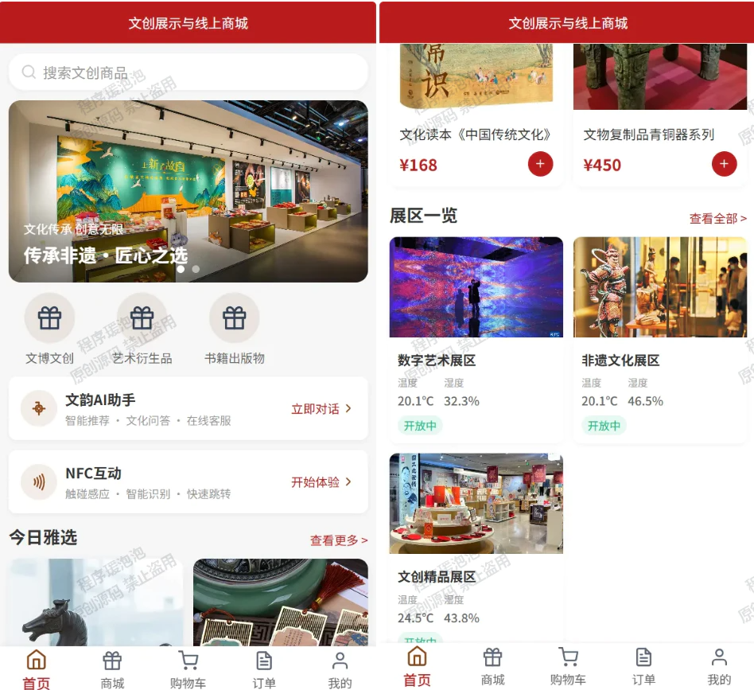
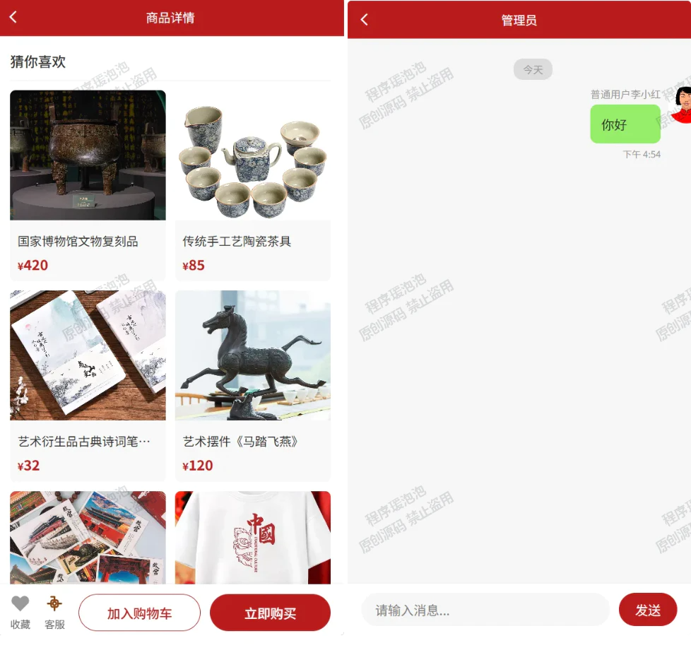
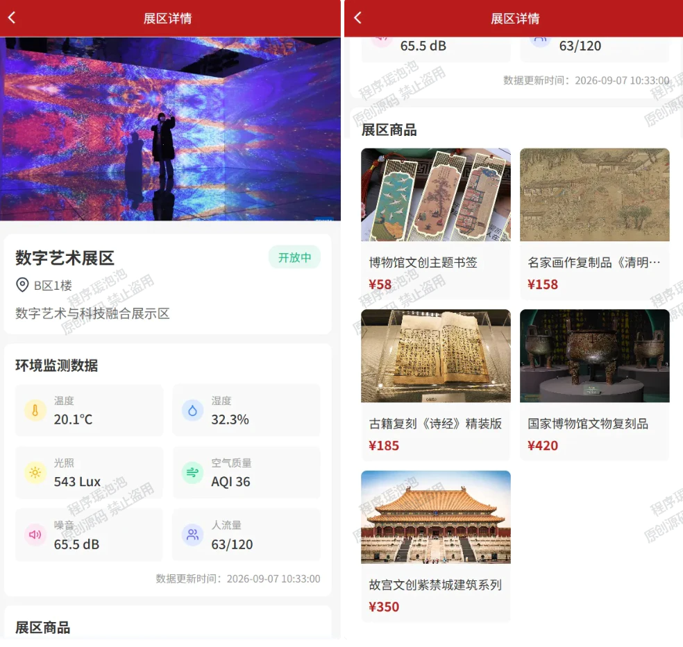
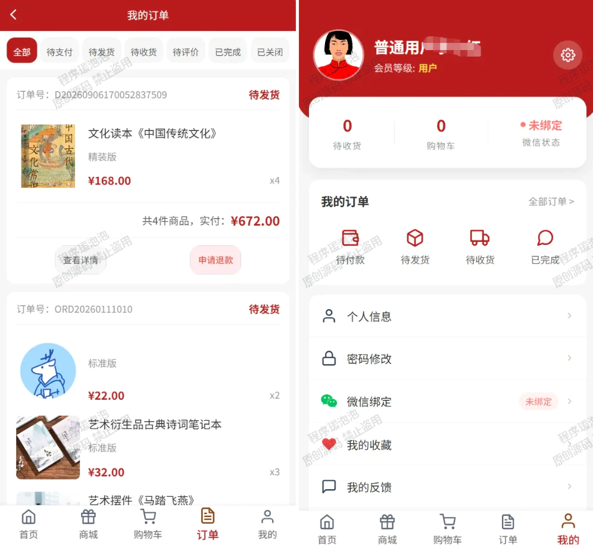
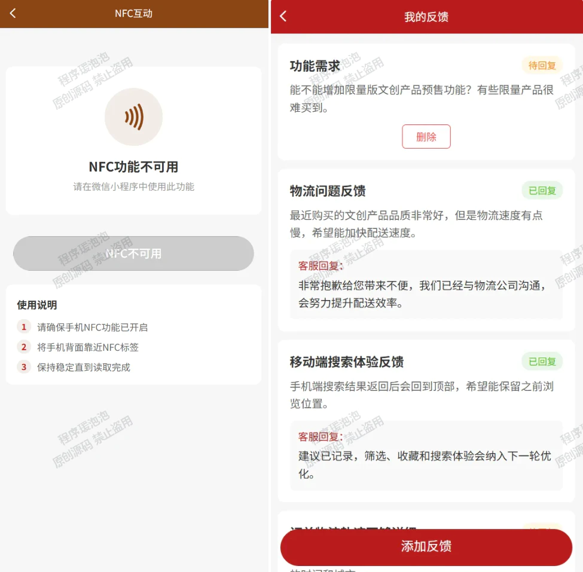
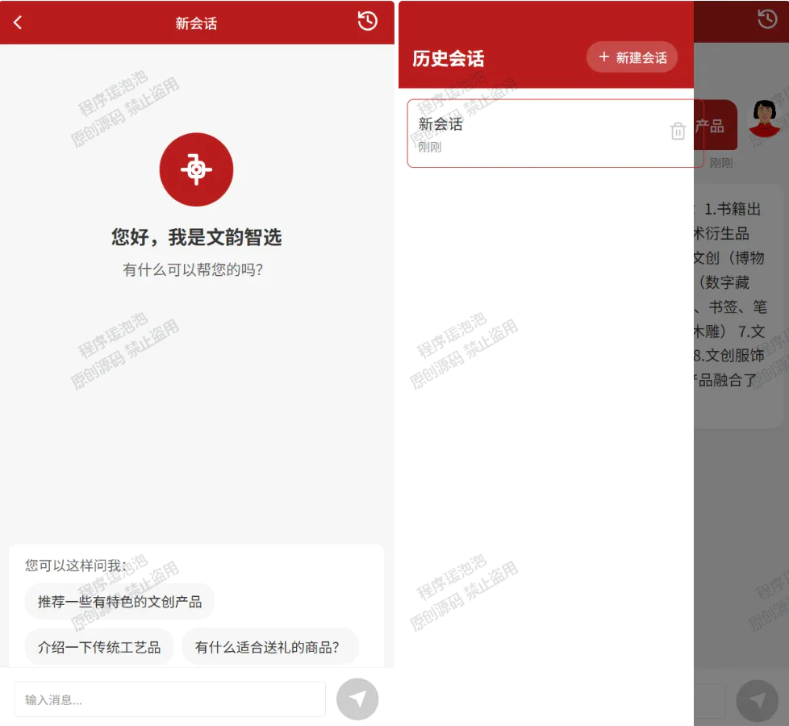
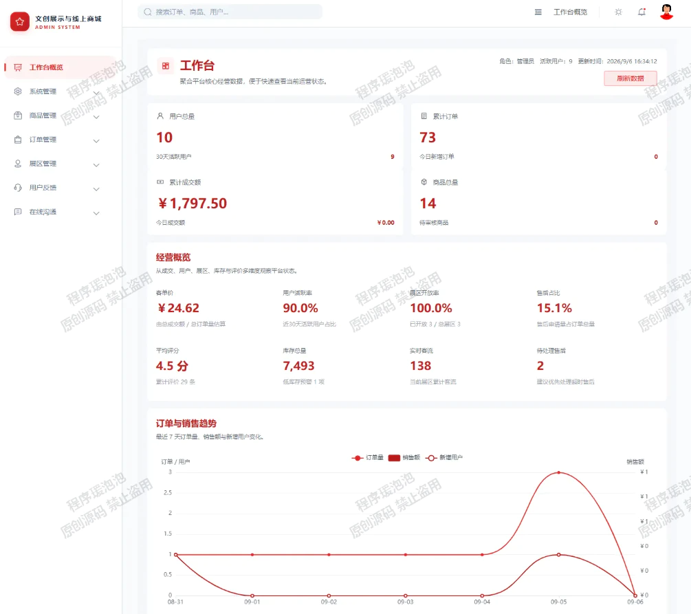
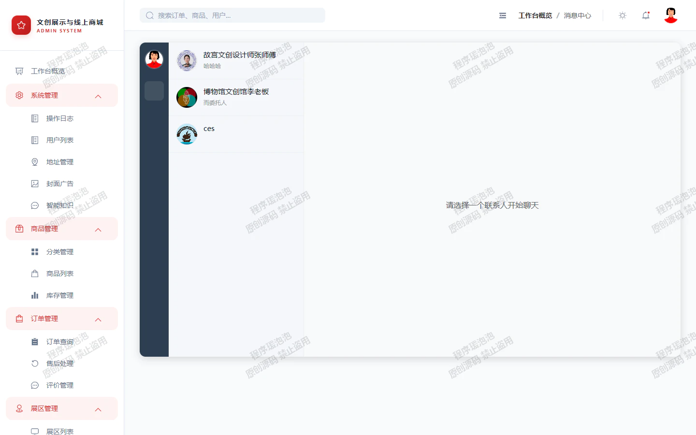
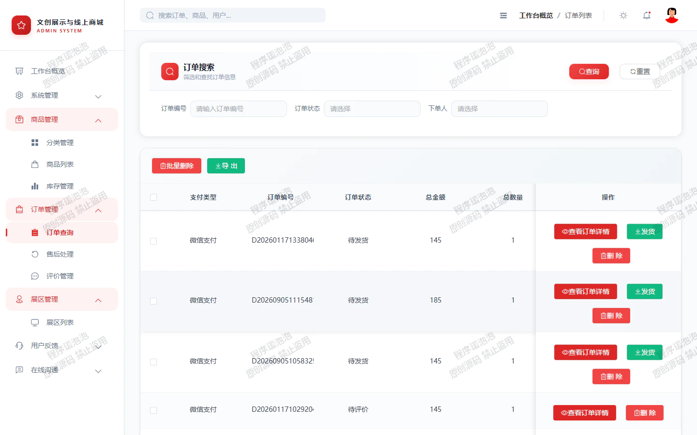
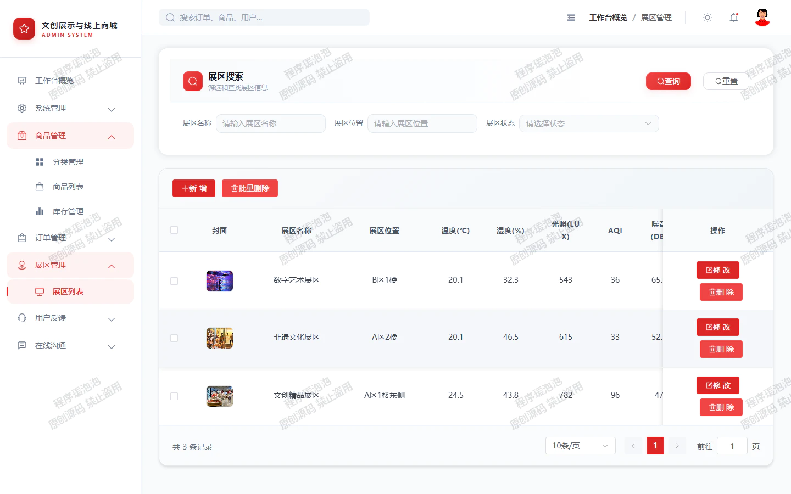

# CulturalShop
融合多传感数据的文创商城小程序 亮点：AI文创问答、协同过滤推荐算法、多传感展区数据监测、ECharts 图形化分析、NFC互动入口、WebSocket 在线沟通、线上商城订单闭环； 角色：用户、管理员；

所有源码均本人开发，项目是前后端分离的，所有的项目都具备了完整的业务逻辑，不仅仅局限于基础的增删改查（CRUD）操作，系统亮点众多。

本文注重于计算机毕业设计选题指导，列出题目均有源码， 大家可以去【公众号】(毕业终点站)获取或者加我【qq】(2112698948)提意见(别忘记Star哟)。备注：git

声明：仅用于学习使用，请勿用于任何商业行为！

1.系统非商用，非开源，非无偿。

2.由本人开发，如需源码，请联系以下方式，qq:2112698948。

3.项目有很多，并未全部上传，如果未找到想要的，可直接咨询。

# 融合多传感数据的文创商城小程序

> 一个把线下文创展陈和线上购物连起来的小程序。小程序端逛商城、看展区传感数据、碰 NFC、问 AI；后台管商品、订单、库存和看板。亮点集中在 **AI 文创问答、协同过滤推荐、多传感展区监测、ECharts 可视化、NFC 互动、WebSocket 在线沟通、商城订单闭环** 这几块。

## 一、系统开发工具与环境搭建

**系统模块**

- `CulturalShop.springboot`：Spring Boot 后端服务，端口 `7257`，提供用户、商品、订单、展区、AI、文件、聊天、看板等接口。
- `CulturalShop.elementui`：Vue3 + Element Plus 后台管理端，端口 `8084`。
- `CulturalShop.uniapp`：uni-app 小程序 / H5 用户端，端口 `5173`。
- `CulturalShop.mqtt-simulator`：展区环境传感器模拟器，通过 MQTT 推送温度、湿度、光照、空气质量、噪音、人流等数据。

**前端技术栈**

| 端 | 技术 |
| --- | --- |
| 后台管理端 | Vue 3、Vite 5、Element Plus、Pinia、Axios、ECharts、AIEditor、Three.js |
| 小程序端 | uni-app、Vue 3、uni-ui、H5 / 微信小程序适配、WebSocket、NFC 页面能力 |
| 开发工具 | Visual Studio Code / HBuilderX / Edge 浏览器调试 |

**后端技术栈**

| 分类 | 技术 |
| --- | --- |
| 基础框架 | Java 17、Spring Boot 3.3.1、MyBatis-Plus、MySQL Connector |
| 认证与通信 | JWT、Spring WebSocket、Spring Integration MQTT |
| AI 与算法 | LangChain4j、DeepSeek 兼容 OpenAI 接口、HanLP、TF-IDF / 相似度计算、协同过滤推荐 |
| 文件与导出 | 本地文件上传、Apache POI Excel 导出 |

**数据库**

使用 MySQL 8.0，库名 `CulturalShop`，初始化脚本 `culturalshop.sql`，含 22 张业务表，覆盖用户、地址、商品、库存、展区、订单、退货、评价、AI 会话、AI 知识库、客服会话、操作日志等模块。

## 二、系统实现（部分截图）

### 2.1 小程序端（用户侧）

#### 首页

首页聚合轮播图、协同过滤推荐商品、文韵 AI 助手入口、NFC 互动入口，以及展区多传感数据摘要。



#### 猜你喜欢 / 客服聊天

商品详情页根据用户行为生成「猜你喜欢」协同过滤推荐；同时承载用户与客服的 WebSocket 在线沟通。



#### 展区列表（多传感监测）

展区详情页实时展示温度、湿度、光照、空气质量、噪音、人流等多传感监测数据，数据由 MQTT 推送、后台看板同步。



#### 我的订单（商城闭环）

订单页展示订单状态、商品明细、支付金额，以及售后、评价、物流等非破坏性操作入口，构成商城下单闭环。



#### NFC 互动

NFC 页面提供触碰识别、手动输入和扫码识别入口，连接线下文创展陈与线上商品信息。



#### AI 文创助手

AI 助手页展示文创知识问答、历史会话与快捷提问入口，后端接入大模型与智能知识库。



### 2.2 管理员端（后台）

#### 数据看板（ECharts）

后台看板汇总用户、订单、成交额、商品、库存、售后、展区客流，并用 ECharts 做图形化分析。



#### 在线沟通（WebSocket）

在线沟通页承载用户与管理员客服的 WebSocket 会话，支持文本消息查看。



#### 订单管理

订单管理页展示订单编号、状态、金额、收货信息与物流单号，提供发货等业务入口。



#### 展区管理（多传感）

展区管理页维护展区位置、封面、容量、开放状态与多传感环境数据。



## 三、系统代码结构说明

**前端代码结构**

```
CulturalShop.elementui
├─ src/router/index.js           后台路由与管理端权限守卫
├─ src/views/Login.vue           后台登录页
├─ src/views/Admin/Dashboard.vue 管理端数据看板
├─ src/views/Admin/Good*.vue     商品、分类、库存与统计页面
├─ src/views/Admin/Order*.vue    订单、售后、评价与统计页面
├─ src/views/Admin/WeChat.vue    在线沟通页面
└─ src/api/http.js               Axios 请求封装

CulturalShop.uniapp
├─ pages/Front/Index.vue         小程序首页
├─ pages/Front/Mall.vue          商城列表
├─ pages/Front/GoodDetail.vue    商品详情与推荐
├─ pages/Front/Exhibition*.vue   展区列表与多传感数据详情
├─ pages/Front/AIChat.vue        AI 文创助手
├─ pages/Front/BuyCard.vue       购物车
├─ pages/Front/Order*.vue        订单、支付、物流、售后、评价
├─ pages/Front/NFCReader.vue     NFC 互动识别
└─ utils/http.js                 小程序请求与流式 AI 请求封装
```

**后端代码结构**

```
CulturalShop.springboot
├─ controller/       用户、商品、订单、展区、AI、文件、聊天、日志等接口
├─ service/impl/     业务逻辑、协同过滤推荐、订单流转、统计分析
├─ entity/           数据库实体模型
├─ dto/              接口传输对象与查询条件
├─ mapper/           MyBatis-Plus Mapper
├─ mqtt/             MQTT 消息处理与展区传感数据更新
├─ sockets/          WebSocket 在线沟通
├─ tools/            JWT、全局异常、Excel、文本相似度、AI 配置等工具
└─ resources/application.yml     运行配置（文档中不展示密钥明文）
```

**数据库表结构**

| 模块 | 数据表 |
| --- | --- |
| 用户与权限 | `sysuser`、`useraddress`、`operationlog` |
| 商品与商城 | `good`、`goodtype`、`goodprop`、`goodstock`、`goodcollect`、`buycard`、`banner` |
| 订单与售后 | `orderinfo`、`orderdet`、`orderreturn`、`ordercomment` |
| 展区传感 | `exhibitionarea` |
| AI 与沟通 | `aiconversation`、`aimessage`、`aiknowledge`、`wechatcollection`、`wechatmessage` |
| 店铺资料 | `shop` |

## 四、特色功能说明

| 功能 | 说明 |
| --- | --- |
| 多传感展区监测 | 展区表保存温度、湿度、光照、空气质量、噪音、人流、最大承载量等字段；MQTT 消息处理器接收传感器数据后更新展区状态，后台看板和小程序展区详情同步展示。 |
| AI 文创问答 | 后端接入 LangChain4j 与 DeepSeek 兼容接口，并维护 AI 知识库、会话、消息表；用户端提供「文韵智选」对话界面。 |
| 协同过滤推荐 | 首页根据用户订单历史调用基于用户的推荐接口，商品详情页根据分类、价格、名称与内容相似度生成「猜你喜欢」。 |
| ECharts 可视化 | 管理端数据看板展示订单趋势、订单状态、商品分类、库存健康、展区环境、客流、评价星级和售后类型等图表。 |
| 商城闭环 | 用户端覆盖商品浏览、规格库存、购物车、下单、支付页、订单列表、物流、售后和评价；后台提供商品、库存、订单、退货和评价管理。 |
| 在线沟通 | 系统包含 WebSocket 会话模块，用户端与后台均有消息页面，支持在线客服式沟通。 |

## 五、部署与启动说明

| 组件 | 步骤 |
| --- | --- |
| 数据库 | 创建 MySQL 数据库 `CulturalShop`，导入 `culturalshop.sql`。 |
| 后端服务 | 进入 `CulturalShop.springboot`，使用 Maven 启动 Spring Boot 服务，默认端口 `7257`。 |
| 后台管理端 | 进入 `CulturalShop.elementui`，执行 `npm install` 后 `npm run dev`，默认端口 `8084`。 |
| 小程序 / H5 端 | 进入 `CulturalShop.uniapp`，通过 HBuilderX 或 H5 开发服务访问 `5173`。 |
| MQTT 模拟器 | 启动本地 MQTT Broker 后运行 `CulturalShop.mqtt-simulator`，按间隔推送展区环境数据。 |

---

> 文档展示 10 张截图，如需了解更多，请联系我。

